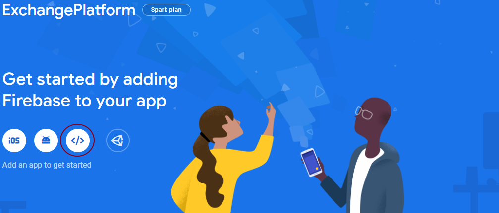

# Universal ExchangePlatform

This code is used for setting up a universal ExchangePlatform build using Vue.js, Node.js and Firebase. <br>
Available functions are:
* Accountmanagement
* Map of offerings
* Searching offerings on the map by address and radius
* Chat to communicate further trade details

## Setup
Prerequisites:
* Google Account for using firebase
* Heroku Account for hosting the application
* 
To setup and run a local instance clone the repository and follow these steps: 
* Go to the [Firebase Console](https://console.firebase.google.com/)
* Setup a new project
* Once created the project add a Web-App to your project:<br>
On the Homepage of your newly created Firebase-Project click on the web-icon (red circled on the screenshot)<br>
    
    <br>
* Add your Firebase-Credentials to the project <br>
Inside the project folder, navigate to 

```bash
$ cd <respositoryName>
$ npm install
$ cd public
$ npm install
$ cd ..
$ npm start
```

Your app should now be running on [localhost:5000](http://localhost:5000/).


## Backend API

### GET /api/search

#### Example Request:

```
http://localhost:5000/api/search?topLeftLocation=52.5,13&lowerRightLocation=54,14
```

#### Example Response:

```json
[
    {
        "user": "Wolverine",
        "location": {
            "lat": 52.5157723,
            "lng": 13.3869281
        },
        "offer": "Nudeln",
        "tradeFor": "Toiletten Papier"
    },
    {
        "user": "Gandalf",
        "location": {
            "lat": 52.5670062,
            "lng": 13.3936488
        },
        "offer": "Dosenwurst",
        "tradeFor": "Mineralwasser"
    }
]
```

### GET /api/chat/:participantId

This requires a valid authentication token from Firebase. The user id is determined from the token.

#### Example Request:

```
http://localhost:5000/api/chat/KhxRmzKFILT8ziEwDhPJZd65lnq1
```

#### Example Response:

```json
[
    {
        "from": "KhxRmzKFILT8ziEwDhPJZd65lnq1",
        "to": "sJoqxWyKobTJZp3LAEoZlcyccKg1",
        "date": "2020-03-20T12:22:38 -00:00",
        "text": "Hi Walter. Ich interessiere mich für dein Mineralwasser. Ich hätte Dosenwurst im Austausch."
    },
    {
        "from": "sJoqxWyKobTJZp3LAEoZlcyccKg1",
        "to": "KhxRmzKFILT8ziEwDhPJZd65lnq1",
        "date": "2020-03-20T14:12:32 -00:00",
        "text": "Gerne. Wann können wir die Waren austauschen?"
    },
    {
        "from": "KhxRmzKFILT8ziEwDhPJZd65lnq1",
        "to": "sJoqxWyKobTJZp3LAEoZlcyccKg1",
        "date": "2020-03-20T14:13:23 -00:00",
        "text": "In 10 min beim Kiosk an der Ecke."
    },
    {
        "from": "sJoqxWyKobTJZp3LAEoZlcyccKg1",
        "to": "KhxRmzKFILT8ziEwDhPJZd65lnq1",
        "date": "2020-03-20T14:15:00 -00:00",
        "text": "Ok. Bis gleich."
    }
]
```

### POST /api/chat/:participantId

This requires a valid authentication token from Firebase. The user id is determined from the token.

#### Example Request body:

```json
{
    "message":"Hello!"
}
```

#### Response

If the message was posted successfully, the endpoint will return `200 OK`.

## Technology Decisions

### Vue.js for frontend

This is where we have the most frontend knowledge currently.

### Node.js for backend

Node.js is easy to setup and learn. Additionally it allows frontend developers with a little Javascript knowledge to help out with backend development.

### Heroku for deployment

Free to use. The following is an excerpt from the Heroku example project `getting-started-with-nodejs`.

#### node-js-getting-started

A barebones Node.js app using [Express 4](http://expressjs.com/).

This application supports the [Getting Started on Heroku with Node.js](https://devcenter.heroku.com/articles/getting-started-with-nodejs) article - check it out.

##### Running Locally

Make sure you have [Node.js](http://nodejs.org/) and the [Heroku CLI](https://cli.heroku.com/) installed.

```sh
$ git clone https://github.com/heroku/node-js-getting-started.git # or clone your own fork
$ cd node-js-getting-started
$ npm install
$ npm start
```